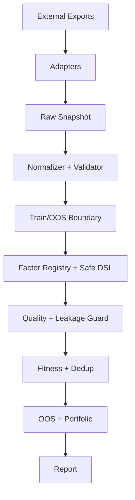

# CogAlpha Research MVP

> Reproducible and leakage-aware quantitative factor research framework for A-share research.

[](https://github.com/GK0421/cogalpha-research-mvp/actions/workflows/ci.yml)
[](https://github.com/GK0421/cogalpha-research-mvp/actions/workflows/security.yml)
[](https://www.python.org/downloads/)
[](https://opensource.org/licenses/MIT)

## ⚠️ Important Disclaimer

This project is for **research and educational purposes only**. It does NOT:
- Execute live trades
- Connect to broker accounts
- Imply any real trading capability
- Constitute investment advice

## 🎯 Project Overview

CogAlpha Research MVP is a quantitative factor research framework that implements a complete
pipeline from data ingestion to out-of-sample validation:

```
Data Import → Raw Snapshot → Normalization & Validation → Train/OOS Isolation
→ Factor Registration & Computation → Quality Check → Leakage Detection
→ IC/RankIC Evaluation → Qualified/Elite Selection → Deduplication
→ OOS Validation → Portfolio Backtest → Robustness Check → Report
```

### Key Features

- **Safe Factor DSL**: No `exec()` or `eval()`. Factors are defined in a whitelist-based DSL.
- **21 Seed Factors**: Built-in deterministic factors across 7 levels (no LLM API required).
- **Strict Sample Isolation**: Training and OOS data are strictly separated with SHA256 fingerprints.
- **Future Info Leakage Detection**: Time-series truncation tests verify no look-ahead bias.
- **Reproducible**: Fixed random seeds, config snapshots, and SHA256 checksums.
- **Research-Only Backtest**: Portfolio simulation with transaction costs, no live trading.
- **Optional LLM Integration**: Works with zero API keys. Add a key to enable LLM-based factor generation (MiniMax, OpenAI, Anthropic, DeepSeek, DashScope).

## 🔧 LLM Integration (Optional)

CogAlpha MVP is designed to work **without any LLM API key**. The 21 built-in seed factors
are fully deterministic and require no external calls.

To enable optional LLM-based factor generation:

1. Copy `.env.example` to `.env`
2. Set any one of the supported API keys:
   - `IFLYTEK_SPARK_API_KEY` (讯飞星辰 Coding Plan, OpenAI-compatible, multi-model)
   - `MINIMAX_API_KEY` (recommended for Chinese market research)
   - `OPENAI_API_KEY` (optionally set `OPENAI_BASE_URL` for proxies)
   - `ANTHROPIC_API_KEY`
   - `DEEPSEEK_API_KEY`
   - `DASHSCOPE_API_KEY`
3. Run `python -m cogalpha_mvp.cli doctor` to verify

#### iFlytek Spark (讯飞星辰)

[iFlytek Spark Coding Plan](https://www.xfyun.cn/doc/spark/CodingPlan.html) is an
OpenAI-compatible API that provides access to multiple models (Spark X2, GLM-5.2,
DeepSeek-V4-Pro, Kimi-K2.6, MiniMax-M2.5, Qwen3.5) through a single endpoint.

```bash
# .env configuration
IFLYTEK_SPARK_API_KEY=your_api_key
IFLYTEK_SPARK_BASE_URL=https://maas-coding-api.cn-huabei-1.xf-yun.com/v2
IFLYTEK_SPARK_MODEL=astron-code-latest
```

The API is fully OpenAI-compatible, so it can be used with the `openai` Python
library by setting the base URL.

If no key is set, the pipeline uses seed factors only and degrades gracefully.
No functionality is lost for MVP-level research.

## 📐 Architecture



See [docs/architecture.md](docs/architecture.md) for detailed architecture documentation.

## 🚀 Quick Start (5-Minute Demo)

### Windows Installation

```powershell
# Clone the repository
git clone https://github.com/GK0421/cogalpha-research-mvp.git
cd cogalpha-research-mvp

# Create virtual environment
python -m venv .venv
.venv\Scripts\activate

# Install the package
pip install -e ".[dev]"

# Check environment
python -m cogalpha_mvp.cli doctor

# Run demo with synthetic data
python -m cogalpha_mvp.cli demo
```

### Importing Real CSV or Parquet Data

```python
from cogalpha_mvp.data.adapters import LocalCSVAdapter
from cogalpha_mvp.domain.data_contract import DataRequest

adapter = LocalCSVAdapter()
request = DataRequest(
    path="data/raw/your_data.csv",
    start_date="2020-01-01",
    end_date="2023-12-31",
)
data = adapter.load(request)
```

Your CSV must have at minimum: `symbol`, `trade_date`, `open`, `high`, `low`, `close`, `volume`.

See [docs/data_contract.md](docs/data_contract.md) for the full data specification.

## 📊 Data Contract

Minimum required fields:

| Field | Type | Description |
|-------|------|-------------|
| `symbol` | string | Stock ticker |
| `trade_date` | date | Trading date |
| `open` | float | Open price (positive) |
| `high` | float | High price (positive) |
| `low` | float | Low price (positive) |
| `close` | float | Close price (positive) |
| `volume` | float | Volume (non-negative) |

See [docs/data_contract.md](docs/data_contract.md) for recommended extension fields.

## 🔒 Factor Protocol

Factors are defined using a safe DSL (no code execution):

```json
{
  "name": "volume_adjusted_momentum_20",
  "agent_id": "Agent_07",
  "expression": "rank(ts_mean(ret(close, 1), 20) / (ts_std(volume, 20) + 1e-8))",
  "direction": 1,
  "description": "20-day return trend adjusted by volume stability"
}
```

See [docs/factor_protocol.md](docs/factor_protocol.md) for the full DSL specification.

## 🧪 Train/OOS Isolation

- Training period: 2011-01-01 to 2019-12-31
- OOS period: 2020-01-01 to 2025-12-31
- Periods must not overlap
- OOS data only loaded during final validation
- SHA256 fingerprints verify data integrity

See [docs/research_methodology.md](docs/research_methodology.md) for methodology details.

## 📋 Output Structure

Each run produces:

```
results/<run_id>/
├── config_snapshot.yaml      # Configuration snapshot
├── environment.json          # Environment info
├── data_manifest.json        # Data fingerprint
├── run_manifest.json         # Run metadata
├── quality/                  # Quality check results
├── train/                    # Training metrics
├── elite_factors/            # Elite factor details
├── dedup/                    # Deduplication results
├── oos/                      # OOS validation metrics
├── portfolio/                # Backtest results
├── report.html               # HTML report
├── summary.json              # JSON summary
└── SHA256SUMS.txt            # File checksums
```

## 🧪 Testing

```powershell
# Run all tests
scripts\run_tests.ps1

# Or manually
ruff check src tests
ruff format --check src tests
mypy src
pytest --cov=src/cogalpha_mvp --cov-report=term-missing
```

## CogAlpha Studio v0.2.0 (Browser-Based Workbench)

Starting from v0.2.0, CogAlpha includes **CogAlpha Studio** - a local-first, browser-based
quantitative research workbench built on top of the CLI framework.

### Quick Start

```bash
# Install dependencies
pip install -e ".[dev]"

# Start the Studio (opens browser)
python scripts/studio_start.py

# Or development mode (starts both API + frontend dev server)
python scripts/studio_start.py --dev
```

### Architecture

```
CogAlpha Studio
  |
  +-- Backend (FastAPI, port 8765, localhost-only)
  |     +-- REST API (43 endpoints)
  |     +-- SQLAlchemy + SQLite (WAL mode)
  |     +-- Background job manager
  |
  +-- Frontend (React + TypeScript + Vite, port 5173)
  |     +-- Dashboard, Projects, Factor Lab, Runs, Settings
  |     +-- Dark theme, ECharts ready
  |
  +-- Docker (multi-stage build)
```

### Key Features

- **Project Management**: Create and manage research projects
- **Data Import**: Upload CSV/Parquet datasets with quality validation
- **Factor Lab**: Interactive DSL expression validator with 21 seed factors
- **Research Runs**: Background pipeline execution with progress tracking
- **Reports**: View HTML reports and factor metrics
- **Settings**: Configure LLM providers (all optional)
- **Localhost-only**: Security-first default binding

### Docker

```bash
cd docker
docker-compose up
# Accessible at http://127.0.0.1:8765
```

## Documentation

- [Architecture](docs/architecture.md)
- [v0.2.0 Architecture Decisions](docs/audit/v0.2.0_architecture_decisions.md)
- [Data Contract](docs/data_contract.md)
- [Factor Protocol](docs/factor_protocol.md)
- [Research Methodology](docs/research_methodology.md)
- [Reproducibility](docs/reproducibility.md)
- [Limitations](docs/limitations.md)

## 🔗 Upstream References

This project was inspired by:
- [GK0421/cogalpha-factor-mining-clean](https://github.com/GK0421/cogalpha-factor-mining-clean) (MIT)
- CogAlpha Operations Manual (PDF, design reference)

See [NOTICE](NOTICE) for details. No code was directly copied.

## ⚠️ Limitations

- Uses synthetic data by default (no real market data included)
- No survivorship-bias-free universe snapshots
- No point-in-time fundamentals data
- Multi-testing bias and data mining bias are present
- This is NOT a live trading system

## 📄 License

MIT License - See [LICENSE](LICENSE) for details.
