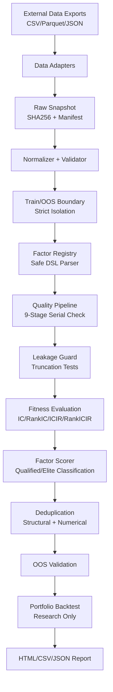

# Architecture

## Overview

CogAlpha Research MVP implements a reproducible quantitative factor research pipeline with strict
sample isolation and leakage detection.

## System Architecture



## Module Structure

```
src/cogalpha_mvp/
├── config.py          # Configuration management
├── cli.py             # Command-line interface
├── logging_config.py  # Logging setup
├── domain/            # Core domain layer
│   ├── data_contract.py    # Standard data contract & validators
│   └── sample_boundary.py  # Train/OOS isolation
├── data/              # Data layer
│   └── adapters.py         # CSV, Parquet, Synthetic, Export adapters
├── factors/           # Factor layer
│   ├── dsl.py              # Safe DSL parser & interpreter (no eval/exec)
│   ├── registry.py         # Factor registration & management
│   └── seed_factors.py     # 21 built-in seed factors
├── quality/           # Quality checking
│   └── pipeline.py         # 9-stage serial quality pipeline
├── evaluation/        # Factor evaluation
│   ├── metrics.py          # IC, ICIR, RankIC, RankICIR
│   ├── scorer.py           # Qualified/Elite classification
│   └── dedup.py            # Structural + numerical deduplication
├── portfolio/         # Portfolio backtest
│   └── backtest.py         # Research-only backtest engine
├── reporting/         # Report generation
│   └── reporter.py         # HTML, CSV, JSON reports
└── pipeline/          # Orchestration
    └── runner.py           # End-to-end pipeline runner
```

## Seven-Level Agent Architecture

| Level | Focus | Agents |
|-------|-------|--------|
| 1 | Market Structure & Cycle | Agent_01 (Trend Phase), Agent_02 (Vol Regime), Agent_03 (Market State) |
| 2 | Extreme Risk & Fragility | Agent_04 (Downside Risk), Agent_05 (Tail Risk), Agent_06 (Liquidity) |
| 3 | Volume-Price Dynamics | Agent_07 (VP Correlation), Agent_08 (Price Impact), Agent_09 (Volume Anomaly) |
| 4 | Price Volatility Behavior | Agent_10 (Momentum), Agent_11 (Reversal), Agent_12 (Vol Clustering) |
| 5 | Multi-scale Complexity | Agent_13 (Multiscale Trend), Agent_14 (Long Memory), Agent_15 (Drawdown) |
| 6 | Stability & Regime Control | Agent_16 (Stability), Agent_17 (Regime Filter), Agent_18 (Signal Decay) |
| 7 | Geometry & Fusion | Agent_19 (Candle Geometry), Agent_20 (Conditional Fusion), Agent_21 (Nonlinear) |

## Data Flow

1. **Data Loading**: Adapters load data from CSV/Parquet/synthetic generator
2. **Normalization**: Column names standardized, types enforced
3. **Validation**: Required fields, OHLC logic, duplicate keys checked
4. **Snapshot**: Raw data fingerprinted with SHA256
5. **Split**: Data split into train/OOS by date boundary
6. **Factor Computation**: DSL expressions evaluated per symbol
7. **Quality Check**: 9-stage serial pipeline
8. **Evaluation**: Cross-sectional IC/RankIC computed per date
9. **Scoring**: Composite percentile score, qualified/elite classification
10. **Dedup**: Structural (expression hash) + numerical (correlation)
11. **OOS**: Same metrics computed on OOS data
12. **Backtest**: Quantile portfolio with transaction costs
13. **Report**: Self-contained HTML with all results

## Security Design

- **No Code Execution**: DSL is parsed by a custom AST walker, never `exec()`/`eval()`
- **Whitelist Operators**: Only approved functions can be used in expressions
- **Forbidden Patterns**: Negative shift, future references, imports, etc. are blocked
- **Secret Isolation**: API keys only from environment variables, never in config/logs/git
- **Data Isolation**: Training objects cannot access OOS data (enforced by LeakageGuard)
